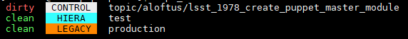

# puppet-helpers
Helper scripts for puppet development

# Installation
1. `git clone https://github.com/andylytical/puppet-helpers.git`
1. `cd puppet-helpers`
1. `./setup.sh`
1. Update PATH (first time only) 
   1. `export PATH="$PATH:$HOME/bin"`

# Commands
### puppet_classes
List all classes, and parameters for each, in specified puppet files
or all puppet files found in and below the current directory
* `cd <MODULE_DIR>`
* `puppet_classes`
* `puppet_classes filename.pp ...`

### update_wip_env
Create the puppet environment `/etc/puppetlabs/code/environments/wip_<USERNAME>`
using contents of current working directories for each repo (`control`, `hiera`, `legacy`)
for testing live changes without commit-push-deploy cycle.

Note: `<USERNAME>` must be passed as a parameter on the cmdline
* root@puppet-master# `update_wip_env <USERNAME>`

### checkout
Checkout the specified branch in each repo (`control`, `hiera`, `legacy`)

For each repo without a matching branch, checkout "production" instead.
* `checkout <TOPIC_BRANCH>`

### repo_status
Show current branch for each repo (`control`, `hiera`, `legacy`).
* `repo_status`

# See also
* [branch-merge-status](https://github.com/ncsa/branch-merge-status)
